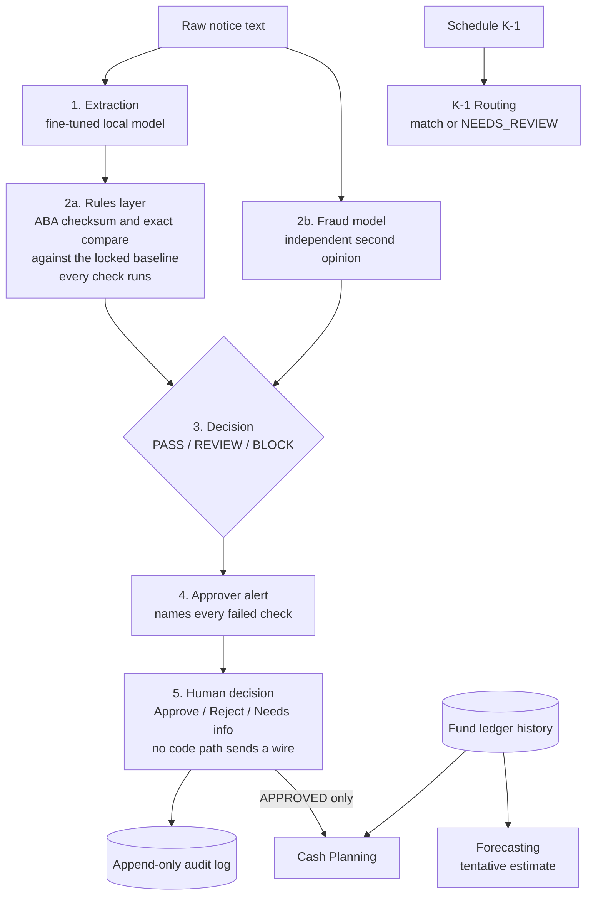
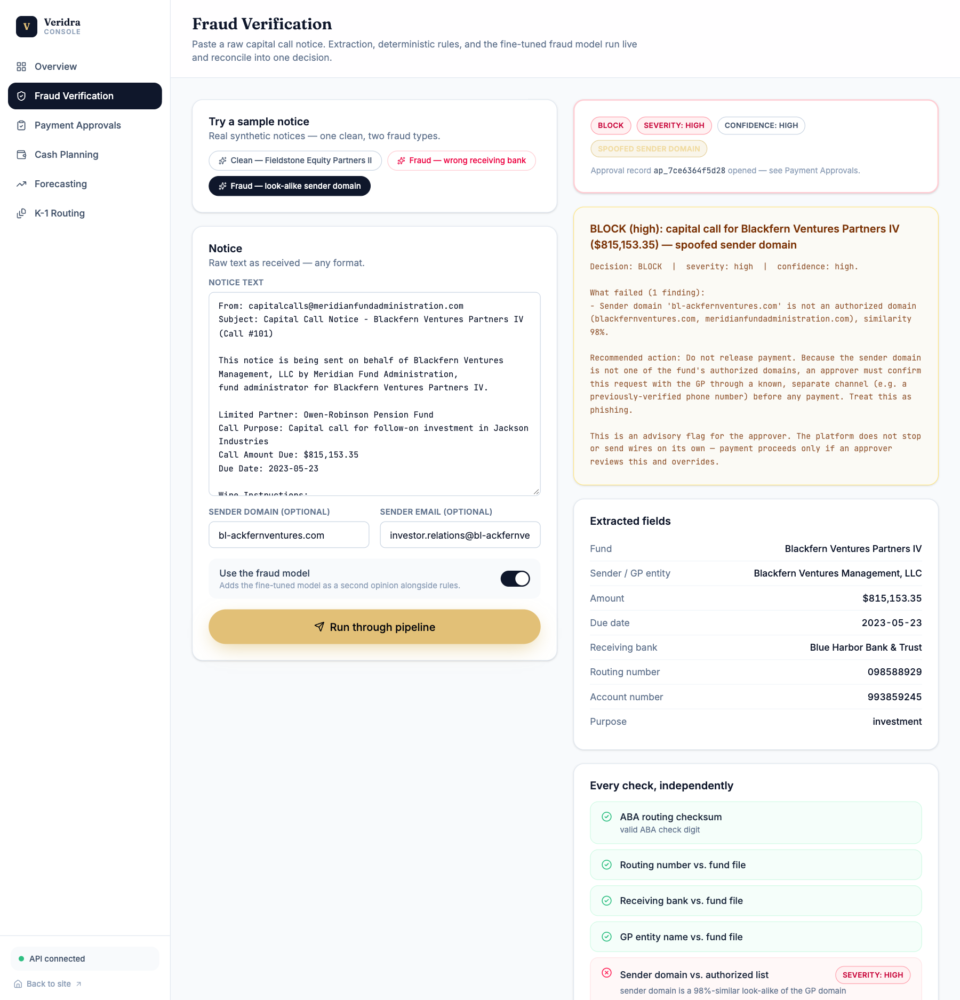
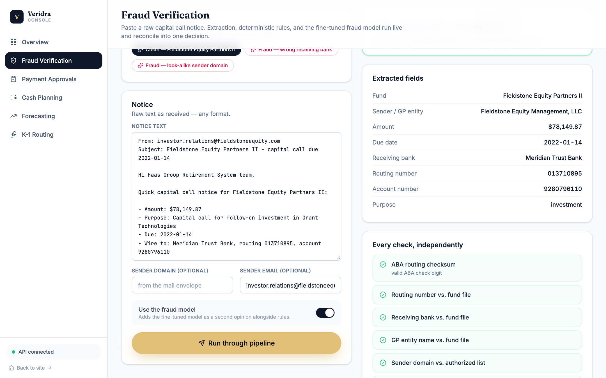
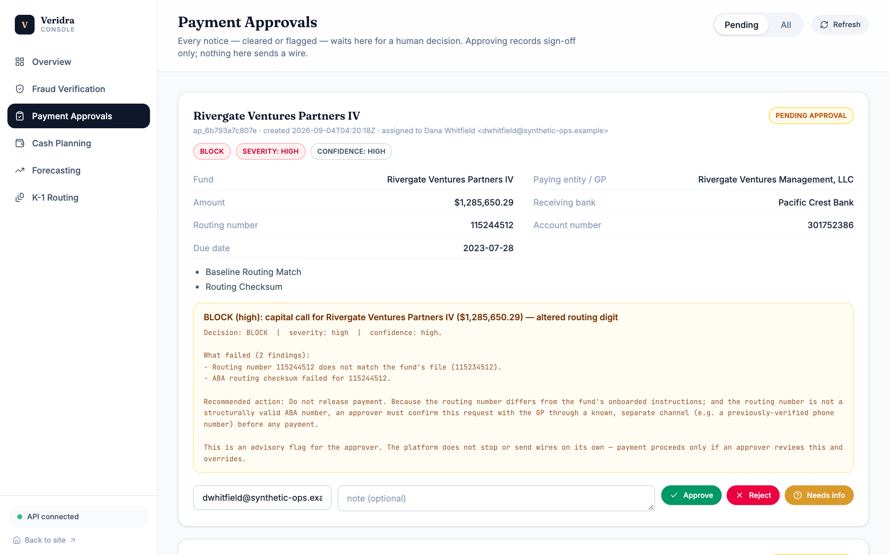
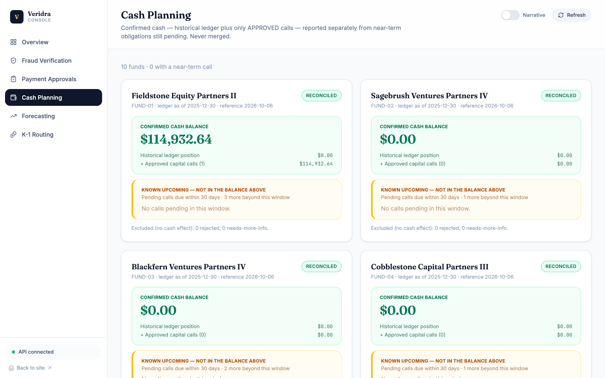
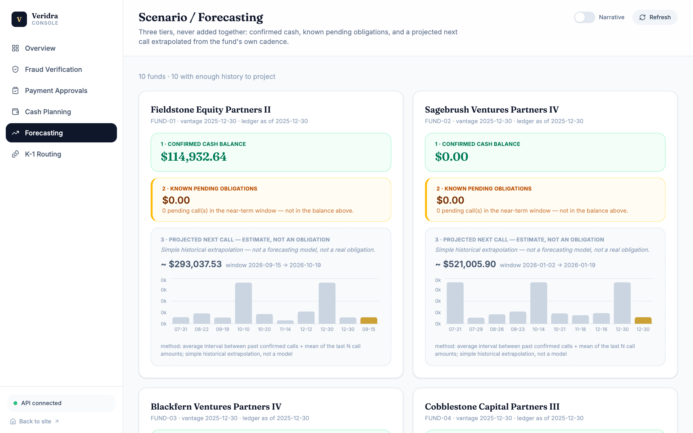
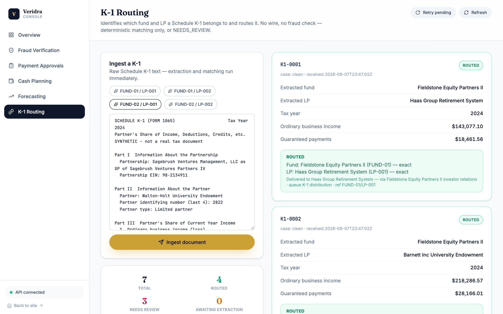

# Veridra Capital

**A personal project exploring capital-call wire-fraud controls, with a human approving every payment.** It verifies each capital call notice, routes every decision through approval, plans cash, forecasts the next call, and matches Schedule K-1s to the right fund and LP, all in one console.

> **Synthetic data only.** Every fund, LP, bank, notice, and balance in this repo is generated. No real financial or personal data appears anywhere. All firm names are fictional, and any resemblance to a real company is coincidental.

<!-- TODO: add the demo video link here once it is uploaded (unlisted YouTube or Loom), e.g.
**Demo video:** [Watch the 70-second walkthrough](https://...) -->


---

## The problem

A capital call notice tells an investor where to wire a large sum. Fraudsters imitate these notices: they alter one routing digit, swap in a different bank, spoof the sender's domain, or push a "last-minute bank change." A single missed detail can send real money to the wrong place.

## What it does

One notice goes in as raw text. One decision comes out. A human always makes the final call.



### Screenshots

All screenshots show the live console running against synthetic data.

**Fraud Verification: a look-alike sender domain is blocked, with the failed check named.**



**Fraud Verification: a clean notice passes every check.**



**Payment Approvals: every notice, cleared or flagged, waits for a human decision.**



**Cash Planning: confirmed cash is reported separately from pending obligations and reconciled per fund.**



**Forecasting: a deterministic, clearly tentative estimate of each fund's next call.**



**K-1 Routing: deterministic matching routes a Schedule K-1 to the right fund and LP, or sends it to review.**



### The five modules

| # | Module | What it does |
|---|---|---|
| 1 | **Fraud Verification** | Extraction, deterministic rules, and a fine-tuned fraud model reconciled into one PASS / REVIEW / BLOCK decision with a named, specific alert. |
| 2 | **Payment Approvals** | Every notice, cleared or flagged, opens a tracked approval record. Append-only audit log, decisions are immutable (only reversible by opening a new record), per-record locking, and a mock notification hook. |
| 3 | **Cash Planning** | Confirmed cash (historical ledger plus only APPROVED calls) reported separately from near-term pending obligations. The two numbers are never merged, and a reconciliation check runs per fund. |
| 4 | **Forecasting** | A deterministic projection of each fund's next expected call from its own history (mean gap plus recent amounts). It is shown as a visibly tentative third tier, clearly labelled an estimate and never summed with actuals. |
| 5 | **K-1 Routing** | Reads a Schedule K-1, identifies the fund and LP with deterministic fuzzy matching, and routes it. If it can't match confidently it goes to NEEDS_REVIEW rather than guessing. If the model is down it waits in AWAITING_EXTRACTION instead of silently downgrading. |

### Design principles

- **Deterministic where it counts.** Baseline comparisons are exact string checks in code. They are never left to a model to eyeball. (The fraud model's own "identical / not identical" claims are ignored and recomputed in code.)
- **Human approval, always.** There is no code path that executes a payment.
- **Every check runs.** The verdict is a function of the full set of failed checks, so there is no first-match-wins ordering bug. Regression tests assert order-independence and pairwise severity.
- **Honest about limits.** Numbers below are on synthetic data and are labelled that way.

---

## Results (synthetic data)

| | |
|---|---|
| Extraction model, held-out (200 notices) | JSON valid 200/200; field exact-match 99.5–100% on all 9 fields |
| Fraud types covered | altered routing digit, wrong bank (valid checksum), misspelled GP name, look-alike sender domain, unverified last-minute bank change, and combined attacks |

These show the pipeline works on synthetic notices built to resemble real ones. They do **not** show performance on real, messy documents (OCR noise, legitimate bank changes, multi-bank funds), which is a different and untested claim. End-to-end results are being re-run on a larger batch and will be added here; earlier small-batch numbers remain in the logs below. See [PIPELINE_DEMO_RESULTS.md](PIPELINE_DEMO_RESULTS.md) and [BUILD_LOG.md](BUILD_LOG.md) for the full record, including the wire-fraud model's four fine-tune iterations and the bugs found along the way.

---

## How it was built

The idea, architecture, workflow, and pipeline design are mine: what the system checks, in what order, where a model may help and where code must decide, and why a human always approves. The code was written with Claude Code, an AI coding assistant, working from that design. I tested it, tried to break it, and fixed what I found; the bugs and decisions are recorded in [BUILD_LOG.md](BUILD_LOG.md).

---

## Repository layout

```
agents/          FastAPI app (agents/app.py) + narrative agents + original static demo pages
verification/    Rules, verdict/severity engine, report reconciliation, end-to-end pipeline
approvals/       Approval state machine, append-only store, notification hook
cash_planning/   Confirmed vs. near-term cash, reconciliation
forecasting/     Next-call projection
k1_routing/      K-1 extraction, matching, tracking
synthetic_data/  Fund / LP / notice / fraud / ledger generator
training/        Fine-tuning data prep, prompts, LoRA configs, Modelfiles, eval scripts
demo_batch/      Leak-free evaluation batch for end-to-end checks
tests/           Regression and contract tests
frontend/        React + Three.js site and live console
docs/            Screenshots used in this README
```

## Tech stack

- **Backend:** Python, FastAPI, SQLite, RapidFuzz
- **Models:** Qwen2.5-1.5B-Instruct, LoRA fine-tuned with MLX (`mlx-lm`), served by Ollama. A general `qwen2.5:3b-instruct` handles narratives and K-1 extraction.
- **Frontend:** React 19, TypeScript, Vite, Tailwind CSS v4, Framer Motion, React Three Fiber, Recharts
- **Demo video:** made with Hyperframes (HTML to MP4) and Kokoro TTS narration; hosted separately, not in this repo

---

## Running it locally

The fine-tuned model weights are **not** in this repo (they are large and gitignored). You need Ollama and the models below to run the full pipeline. See "Reproducing the models".

**1. Backend**

```bash
python3 -m venv capital-call-env && source capital-call-env/bin/activate
pip install -r requirements.txt
python -m synthetic_data.run_pipeline      # regenerate the synthetic dataset (~112 MB, gitignored)
uvicorn agents.app:app --port 8000
```

API docs: http://localhost:8000/docs

The pipeline calls Ollama at `http://localhost:11434` and expects these models:

- `capitalcall-extract`: fine-tuned field extraction
- `capitalcall-fraud`: fine-tuned wire-fraud second opinion
- `qwen2.5:3b-instruct`: narratives and K-1 extraction

**2. Frontend**

```bash
cd frontend
npm install --legacy-peer-deps
npm run dev          # http://localhost:5173
```

The home page is the animated marketing site. The live console is at `/console`: Overview, Fraud Verification, Payment Approvals, Cash Planning, Forecasting, and K-1 Routing. The console calls the API at `http://localhost:8000` (override with `VITE_API_BASE`). If you run Vite on a different port, add that origin to the CORS list in [agents/app.py](agents/app.py).

To try it: open **Console → Fraud Verification**, load a sample notice (one clean, two fraudulent), and run it through the pipeline. Then open **Payment Approvals** to act on the record it created.

**3. Tests**

```bash
./predeploy.sh      # import check + full regression suite; the gate before shipping a model or pipeline change
```

## Reproducing the models

The training data and configs are included.

1. Prepare data: `training/prepare_data.py` (extraction), `training/prepare_fraud_data.py` and `training/augment_domain_data.py` (fraud)
2. Fine-tune with `mlx_lm.lora` using [training/lora_config.yaml](training/lora_config.yaml) and [training/fraud_lora_config.yaml](training/fraud_lora_config.yaml) (QLoRA on `mlx-community/Qwen2.5-1.5B-Instruct-4bit`)
3. Fuse the adapters (`mlx_lm.fuse --dequantize`), then `ollama create` from [training/Modelfile](training/Modelfile) and [training/Modelfile.fraud](training/Modelfile.fraud)

Training was done on an 8 GB MacBook Air (M3). [BUILD_LOG.md](BUILD_LOG.md) documents the memory-pressure crash and the settings that avoid it.

## Known limitations

- No authentication. This is a local demo surface, not a production system.
- Notifications are logged to a file only (a real email or Slack sender is a future plug-in).
- The approval store is a JSONL file with in-process locking, so it is safe in a single process only.
- All accuracy figures are on synthetic data (see Results).
- The older single-fund endpoints in [agents/](agents/) (`/forecast/{id}`, `/k1/route`) coexist with the newer modules and are slated for consolidation.

## License

Evaluation-only. You are welcome to view, clone, and run this project to evaluate it (for example, as part of a hiring or portfolio review). Copying, modifying, redistributing, or commercial use requires written permission. See [LICENSE](LICENSE).
